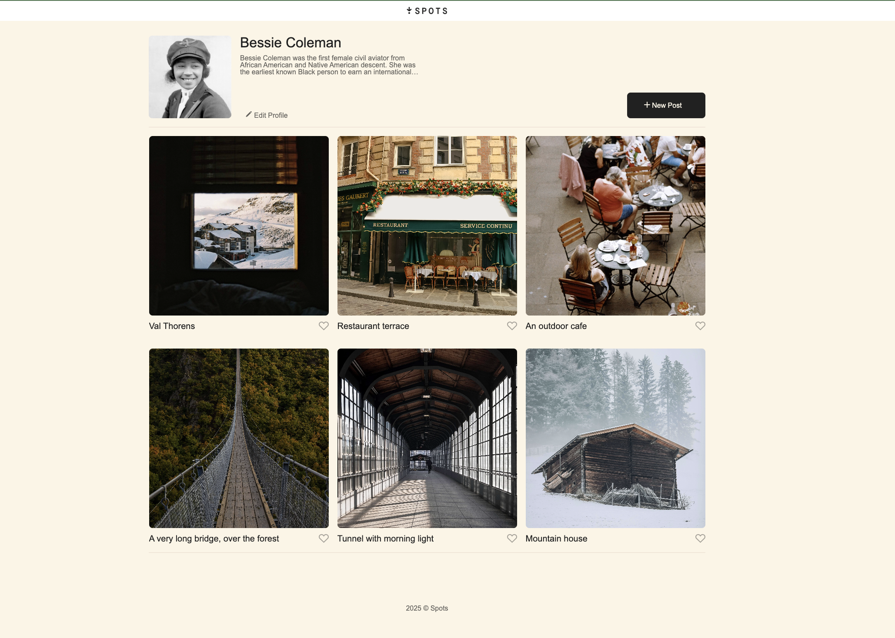

# Project 3: Spots

Spots social media site is the third project for the Software Engineering program with TripleTen. This project explores the concepts of creating a responsive website and setting parameters for different screen sizes using media queries.

## Project Features

- Semantic HTML5
- CSS
- Flexbox
- Grid layouts
- Media queries

